# Lecture 2 Image Formation

## Camera and Lens

### Pinhole Camera

A barrier to block off most of the rays. The opening is the **aperture 光圈**.
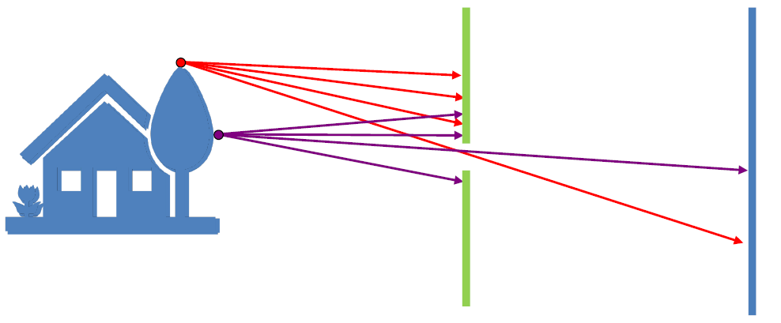

!!! tip "Flaws"
	- Less light gets through.
	- Diffraction effects（衍射）

### Lens 透镜

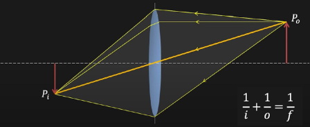

$$
\frac{1}{i} + \frac{1}{o} = \frac{1}{f}
$$

#### Focal length $f$  焦距

if $o = \infty$, then $f = i$.

#### Magnification $m$ 放大率

$$
m = \frac{h_i}{h_o}
$$

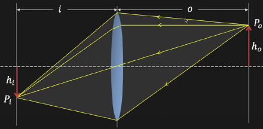

#### Field of View (FOV) 视野

##### Factor
-  Focal Length
  - Longer focal length, Narrower angle of view. Vice versa.

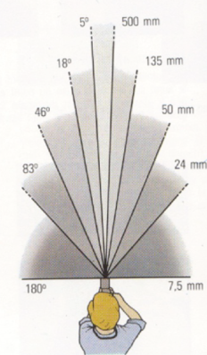

!!! note 
	50mm / 46° (and full frame) is the most similar FOV with human eyes. Thus 50mm lens is called **standard lens**（标准镜头）.
	
	- telephoto lens （长焦镜头，望远镜头）：视野小，放大率大
	- short focal lens （短焦镜头，广角镜头）：视野大，放大率小
-  Sensor Size
  - Bigger sensor size, Wider angle of view. Vice versa.

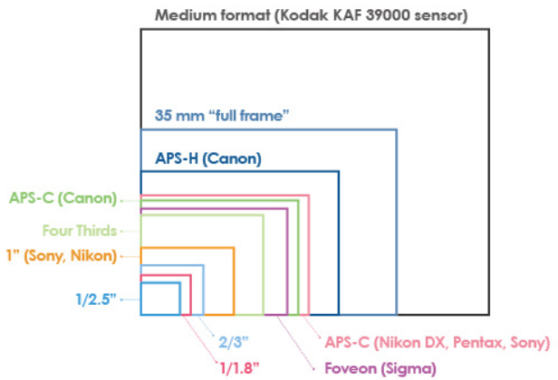

### Aperture 光圈

The representation of aperture is its Diameter $D$.

**F-Number**

$$
N = \frac{f}{D} \text{ (mostly greater than 1, around 1.8 ~ 22)}
$$

### Lens Defocus
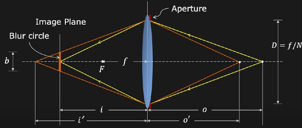

Blur Circle Diameter (光斑半径)

$$
b = \frac{D}{i'}|i' -i|, b \propto D \propto \frac{1}{N}
$$

### Focusing 对焦

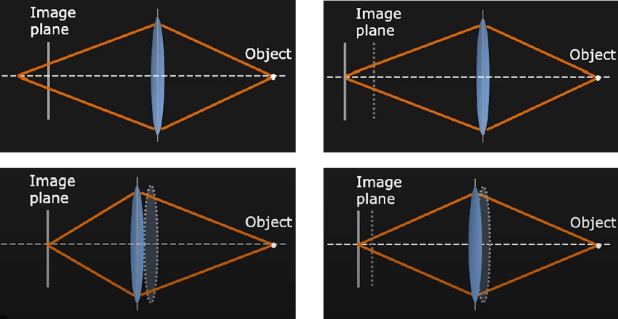

#### Depth of Field (DoF) 景深

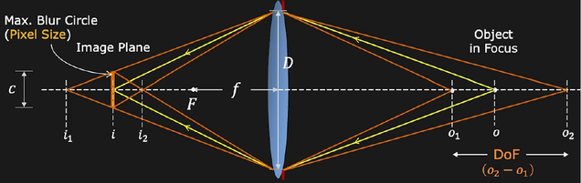

$$
{\tt DoF} = o_2 - o_1 = \frac{2of^2cN(o-f)}{f^4-c^2N^2(o-f)^2}
$$

From the equation above DoF is almost proportional to $N$, and thus the Larger aperture, the Smaller F-Number and the Smaller DoF.

#### How to blur the background

-  Large aperture
-  Long focal length
-  Near foreground
-  Far background

## Geometric Image Formation（定位）

!!! note "Camera model"
	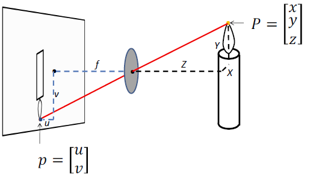

$$
\begin{bmatrix}
u \\
v
\end{bmatrix}
=
\begin{bmatrix}
f \frac{x}{z} \\
f \frac{y}{z}
\end{bmatrix}
$$

### Homogeneous Coordinates / Projective Coordinates

Suppose that $\begin{bmatrix} x \\ y \\ w \end{bmatrix}$is the same as $\begin{bmatrix} x/w \\ y/w \\ 1 \end{bmatrix}$, then we get

$$
\begin{bmatrix}
f & 0 & 0 & 0 \\
0 & f & 0 & 0 \\
0 & 0 & 1 & 0
\end{bmatrix}
\begin{bmatrix}
x \\
y \\
z \\
1
\end{bmatrix}
= 
\begin{bmatrix}
fx \\
fy \\
z \\
\end{bmatrix}
\cong
\begin{bmatrix}
f\frac{x}{z} \\
f\frac{y}{z} \\
1
\end{bmatrix}
$$

We can also put the image plane in front of the camera (opposite to the previous picture).

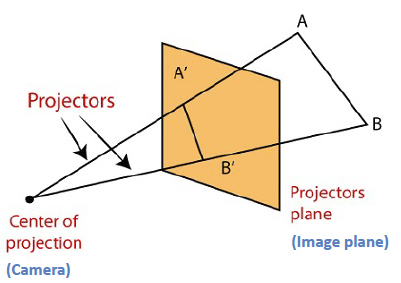
### Perspective Projection

- Preserevd - Straight lines are still straight
- Lost - Length and Angle

#### Vanishing Points

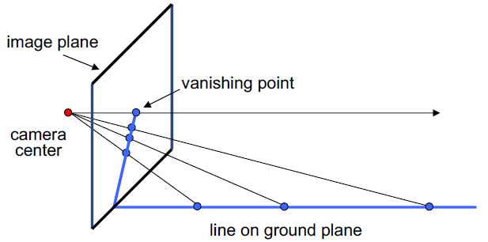
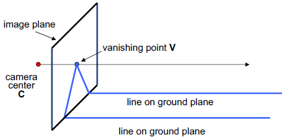

!!! note "Properties"
	- Any wo parallel lines have the same vanishing point **v.**
		- **v** can be outside the image frame or at infinity.
	- Line from **C** to **v** is parallel to the lines.

#### Vanishing Lines

Multiple vanishing points

The direction of the vanishing line tells us the orientation of the plane.

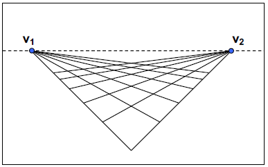
#### Distortion

- Converging verticals

<figure markdown> 
	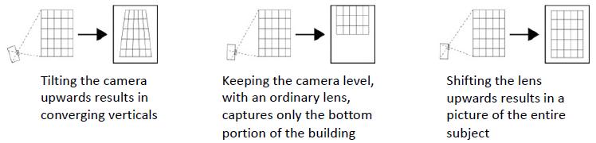
	<figcaption>Problem and Solution (View Camera 移轴相机)</figcaption>
</figure>

- Exterior columns appear bigger
	- Due to lens flaws
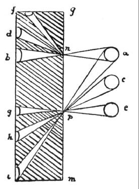
- Radial distortion
	- Due to imperfect lens

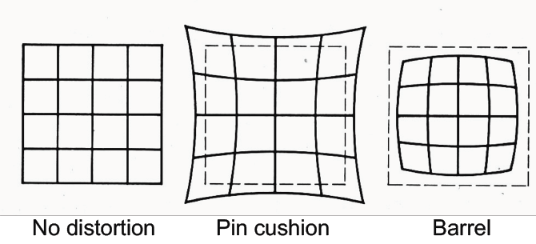

$$
\begin{align}
r^2 &= {x'}_n^{2} + {y'}_n^{2} \\
{x'}_d &= {x'}_n(1 + \kappa_1r^2 + \kappa_2r^4) \\
{y'}_d &= {y'}_n(1 + \kappa_1r^2 + \kappa_2r^4) \\
\end{align}
$$

!!! success "Solution"
	Take a photo of a grid at the same point and then use the mathmatics to calculate and correct radial distortion.

#### Orthographic Projection

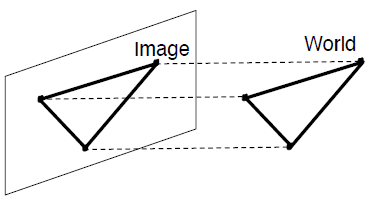

$$
\begin{bmatrix}
1 & 0 & 0 & 0 \\
0 & 1 & 0 & 0 \\
0 & 0 & 0 & 1
\end{bmatrix}
\begin{bmatrix}
x \\
y \\
z \\
1
\end{bmatrix}
= 
\begin{bmatrix}
x \\
y \\
1 \\
\end{bmatrix}
\Rightarrow
(x, y)
$$

### Photometric Image Formation（定颜色/亮度）

#### Image Sensor

-   CMOS
-   CCD (Charge Coupled Device)

#### Shutter

Shutter speed controls exposure time.

#### Color Sensing

-   Color Spaces
	-   RGB
	-   HSV

-   Practical Color Sensing: **Bayer Filter**

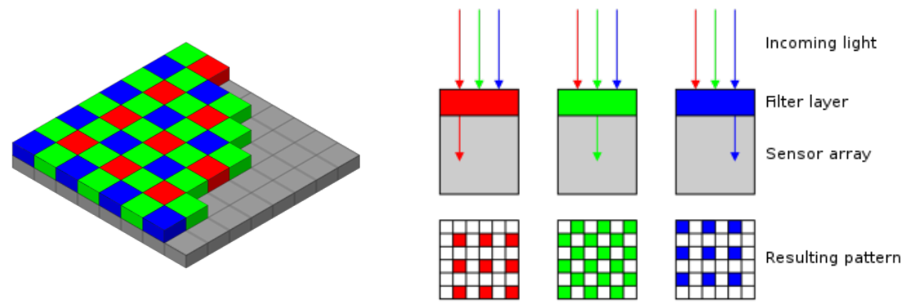

#### Shading 着色

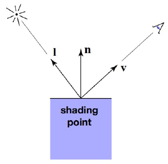

##### BRDF (Bidirectional Reflectance Distribution Function)

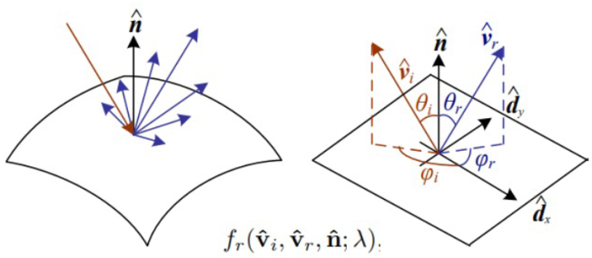

$$
L_r(\hat{\textbf{v}_r};\lambda) = \int L_i(\hat{\textbf{i}_r};\lambda)f_r(\hat{\textbf{v}_r}, \hat{\textbf{v}_i}, \hat{\textbf{n}}; \lambda)\cos^+\theta_i\ d\hat{\textbf{v}_i}
$$

##### Diffuse (Lambertian) Reflection

-   Shading independent of view direction

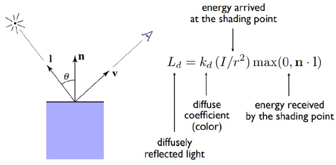
##### Specular Term

-   Intensity depends on view direction
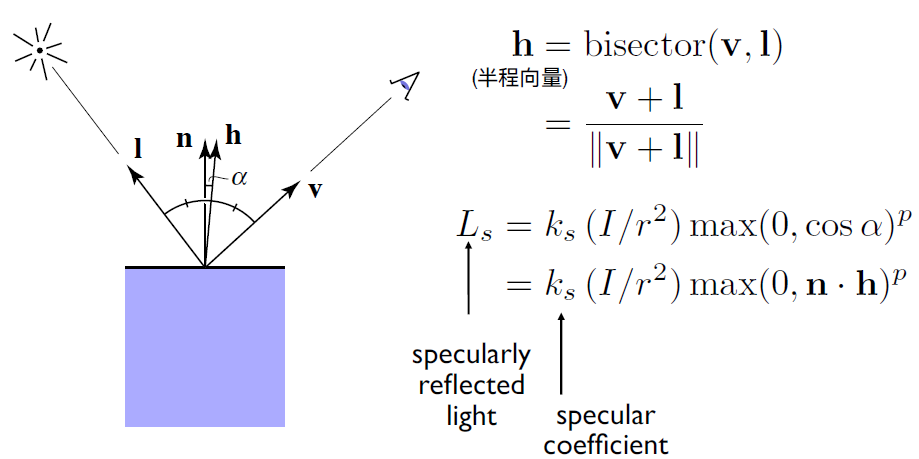

##### Blinn-Phong Reflection Model

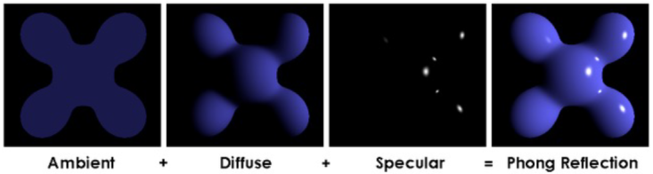

$$
L = L_a + L_d + L_s = k_aI_a + k_d(I/r^2)\max(0, \textbf{n}\cdot\textbf{l}) + k_s(I/r^2)\max(0, \textbf{n}\cdot\textbf{h})^p
$$