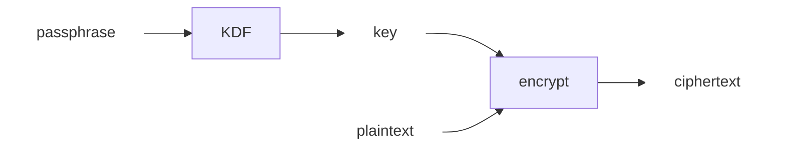
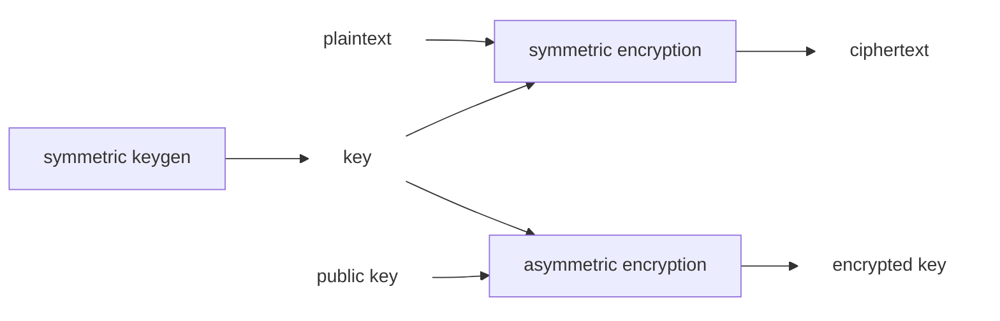
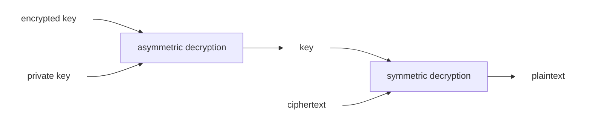

# The Missing Semester of Your CS Education

!!! info
    **Lecturer:** [Anish](https://github.com/anishathalye), [Jon](https://github.com/jonhoo) and [Jose](https://github.com/JJGO).

    **Course Website:**
    
    [The Missing Semester of Your CS Education](https://missing.csail.mit.edu/). ([Chinese Version](https://missing-semester-cn.github.io/)) [MIT 2020 version].

!!! abstract "My Feedback and Things Needed to Know before learning this course"

    Generally, it's a course to teach you many useful tools, mostly based on command line. The environment is Mac OS / Linux based OS, and the shell they use is zsh. These tools help you doing things more efficiently and proficiently. However, I think having got a master of python and JSON will make you a better understanding of this course, which I haven't yet. :-<

    **Records** on Youtube are really recomended, which also enables your learning skills through English. Because much content is not in the lecture notes.

    By the way, Jose had quite an accent so English substitutions are recomended. :-)

## 1. Course Overview and the Shell

## 2. Shell Tools and Scripting

### Script

>  Reference : Advanced Bash-Scripting Guide

- **Assignment** `foo=bar`.
- **Access value** `$foo`, `$(foo)`, `${foo}`.

???+ tip
    Sometimes `${foo}` is not allowed depending on shell. Thus `$(foo)` is usually used.

- **Space** are the delimiters in shell. So `foo = bar` will be split to three arguments.

!!! note "Difference between quote `'` and `"`"

    Provided that `foo=bar`, then echo `"$foo"` prints `bar` and echo `'$foo'` prints `$foo`.

- Return value
    - Commands will ofter return output through `STDOUT`, errors through `STDERR`.

- Special identifiers (selected, not all)
    - `$0` - Script name (command name).
    - `$1` to `$9` - Arugments to the script.
    - `$@` - All the arguments.
    - `$#` - Number of arguments.
    - `$?` - Return code of the previous command. If the previous command executes successfully, `$?` will return `1`, otherwise `0`.
    - `$$` - Process identification number (PID) for the script
    - `!!` - Entire last command. It's useful for sudo `!!`.
    - `$_` - Last argument from the last command.

- Short-circuiting operators 短路运算符
    - `&&` and `||`. The same meaning as in C language.

- Substitution
    - Command Substitution
        - `$(CMD)` will executes command `CMD` and its return value replaces `$(CMD)`.
        - *e.g.* `for file in $(ls)` to iterate the files.
    - Process Substitution
        - `<(CMD)` will executes command `CMD` and its return value will be stored in a temporary file. That's useful when the return value is passed by file instead of `STDIN`.
        - *e.g.* `diff <(ls foo) <(ls bar)`.

- Globbing 通配
    - `?` match one amount of characters, `*` match any amount of characters.
        - *e.g.* `rm foo*` will remove `foo`, `foo1` and `foo123`. `rm foo?` will only remove `foo1`.
    - `{}` expand the value in it.
        - *e.g.* touch `{foo,bar}/{a..c}` will expand to `touch foo/a foo/b foo/c bar/a bar/b bar/c`; `convert image.{png,jpg}` will exapand to `convert image.png image.jpg`.

**Shebang**

When writing bash script, you will commonly see `#!/usr/bin...` called **shebang** at the first line. When executed, it will run the script by the program this line specifies, not necessarily bash.

Use command `env` for shebang is a good pratice. *e.g.* `#!/usr/bin/env python` will let shell execute the script using python.

???+ Example
    The following script will iterate through the arguments of files and append `# foobar` if the file has no `foobar`.

    ```bash
    #!/bin/bash

    echo "Starting program at $(date)" # Date will be substituted

    echo "Running program $0 with $# arguments with pid $$"

    for file in "$@"; do
        grep foobar "$file" > /dev/null 2> /dev/null
        # When pattern is not found, grep has exit status 1
        # We redirect STDOUT and STDERR to a null register since we do not care about them
        if [[ $? -ne 0 ]]; then
            echo "File $file does not have any foobar, adding one"
            echo "# foobar" >> "$file"
        fi
    done
    ```

### Shell Tools

!!! question "How to use commands?"
    - `man`, `CMD -h` or `CMD --help`.
    - `tldr` (short for *Too Long Don't Read*) is also a good tool to search for frequently used methods of the command.

#### Finding Files

!!! plane ""
    `find`

    - Simple usage
        - `find . -name src -type -d` finds all the directories named srcin the current directory.
        - `find . -path '*/test/*.py' -type f` finds all  .py files that have a parent folder named testin the current directory.
        - `find . -mtime -1` finds all files modified in the last day.
        - `find . size +500k -size -10M -name '.tar.gz'` finds all `.tar.gz` files with size ranging 500k to 10M.
    - Advanced usage
      - `find . -name '*.tmp' -exec rm {} \;` removes all `.tmp` files
      - `find . -name '*.png' -exec convert {} {}.jpg \;` convert all PNG files to JPG files.
    - Generally, `PATTERN` is used for match like `find . -name 'PATTERN'`. `-iname` is optional to ignore the letter case.

    `fd`, a better tool than `find`.

!!! plane ""
    `locate`

    - `locate` uses a database updated by `updatedb`.
    - It's faster to find files in some certain directories.

#### Finding Code

`grep`

- `-C` for getting context around the matching result.
- `-v` for inverting the result.
- `-R` for recursive finding.

`rg` (short for `ripgrep`)

???+ example

    - `rg -t py 'import requests'` finds all .py files using requestslib.
    - `rg -u --files-without-match "^#!"` finds all files (including hidden files) without a shebang line.
    - `rg foo -A 5` finds all match of fooand prints the following 5 lines.
    - `rg -stats PATTERN` print statistics of matches.

#### Find Shell Commands

- `history` with `grep`.
- `Ctrl + R` performs backwards search through history. It can be used with `fzf`.

???+ note "history-based autosuggestions"
    It's first introduced by fish shell. This feature dynamically autocompletes the current shell command with the most recent command.

#### Directory Navigation

- `alias` for command short cut. `ln -s` creates symbolic links.
- `fasd` or `autojump` finds frequent or recent files and directories.
- `tree` or `brootgive` an overview of a directory structure.
- `nnn` or `ranger` is full fledged file manager. 

## 3. Editors (Vim)

Since I've learned about vim before. For the detail of basic operations please see the lecture notes and other resources. The following are some supplements.

### Vim-mode in other programs

- Shell.
- Readline.
- Vim in Browsers (Vimium-C), even in Jupyter notebooks.

### Advanced Vim

#### Search and Replace

`:s`: `%s/foo/bar/g` to replace `foo` with `bar` globally in file. `%s/\[.*\](\(.*\))/\1/g` is to replace named Markdown links with plain URLs.

#### Macro

- `q{character}` to start recording a marcro in register `{character}`.
- `q` to stop recording.
- `@{character}` replays the macro
    - `{number}@{character}` executes a macro `{number}` times.
- Macros can be recursive.

???+ example "Example : convert xml to json"
    [File](https://missing.csail.mit.edu/2020/files/example-data.xml)

    1. Record a macro stored in register `e` to format a single element.
        - Go to line with `<name>`
        - `qe^r"f>s": "<ESC>f<C"<ESC>q`
    2. Record a macro stored in registser `p` to format a person.
        - Go to line with `<person>`
        - `qpS{<ESC>j@eA,<ESC>j@ejS},<ESC>q`
    3. Record a macro stored in register `q` to format a person and go to the next person.
        - Go to line with `<person>`
        - `qq@pjq`
    4. Execute macro until end of file.
        - `999@q`
    5. Manually remove last `,` and add `[` and `]` delimiters.

## 4. Data Wrangling

An example runs through this lecture : Wrangle the data from `ssh myserver journalctl`.

### Regular Expressions (Regex)

#### Common patterns

- `.` matches any singel character except newline `\n` or `\r`.
- `*` zero or more of the preceding match.
- `+` one or more of the preceding match.
- `[abc]` matches any one character of `a`, `b` and `c`.
- `(RX1|RX2)` either matches `RX1` or `RX2`.
- `^` the start of the line.
- `$` the end of the line.
- By default, `*` and `+` are greedy. Suffix `*` or `+` with `?` to take it non-greedy.

#### Capture group

- Any match of parenthesis will stored in the capture group (unless `?:` or other similar patterns are put in the front of the parenthesis). We can use `\1`, `\2` to refer them.

More patterns and details for regex on [Regular expression - Wikipedia](https://en.wikipedia.org/wiki/Regular_expression) or [正则表达式 – 教程 | 菜鸟教程](https://www.runoob.com/regexp/regexp-tutorial.html).

A nice tool to check regex: [regex101: build, test, and debug regex](https://regex101.com/r/qqbZqh/2).

!!! plane ""
    `sed`

    `sed` is a stream editor building on top of the old `ed` editor. It supports regex for data wrangling.

    Mostly used command are `s` (substitution). Its syntax is `s/REGEX/SUBSTITUTION`. `REGEX` is the regular expression, `SUBSTITUTION` is the text to substitute matching text with.
    
    Regex of `sed` is a bit weird. It requires a `\` before most of the character above to give them special meaning. Or more intuitively, pass `-E`.

    But `sed` don't support non-greedy mode. Another tool supporting non-greedy is `perl -pe`.

At the last of these part, regex is used to wrangle data with the following command.

```bash
ssh myserver journalctl
| grep sshd
| grep "Disconnected from"
| sed -E 's/.*Disconnected from (invalid |authenticating )?user (.*) [^ ]+ port [0-9]+( \[preauth\])?$/\2/'
```

### Other command for data wrangling

!!! plane ""
    `sort`

    - By default, it sorts the data with the first column as a key word and ascending lexicographic order.
    - `-n` will sort in numeric order.
    - `-r` will reverse.
    - `-u` will take the unique value.
    - `-k` specifies the coloum as a key word.

!!! plane ""
    `uniq`

    - filter repetitive lines
    - `-c` or `--count` will show a count of the number of occurrences.
    - `-u` will show the lines that only occur once.

!!! plane ""
    `wc`

    - count something
    - `-c` or `--bytes` or `--chars` will show the count of bytes.
    - `-l` or `--lines` will  show the count of lines.
    - `-w` or `--words` will show the count of words.

!!! plane ""
    `paste`

    - `-d<delimiter>` or `--delimiters=<delimiter>` specifies the delimiter.
    - `-s` or `--serial` combines multiple lines into one line.

!!! plane ""
    `awk`

    `awk` is a programming language that just happens to be good at processing text streams. As with many other things here, only basic wll be gone through.

    - `$0` is set to the entire line. `$1` through `$n` are set to the *n*-th field of that line, when separated by awk field separator (white space by default, change with `-F`).
    - So `| awk '{print $2}'` will print the second part from `STDIN`. 
    - Compute the number of single used usernames that match some regex pattern (start with `c` and end with `e`) from `STDIN`: `| awk '$1 == 1 && $2 ~ /^c[^ ]*e$/ {print $2}' | wc -l`. `wc -l` is also not needed for it if we rewrite the `awk` part to `awk 'BEGIN {rows = 0} $1 == 1 && $2 ~ /^c[^ ]*e$/ {rows += $1} END {print rows}'`. `BEGIN` and `END` are patterns that match the start and the end of the input respectively.

```bash
ssh myserver journalctl
 | grep sshd
 | grep "Disconnected from"
 | sed -E 's/.*Disconnected from (invalid |authenticating )?user (.*) [^ ]+ port [0-9]+( \[preauth\])?$/\2/'
 | sort | uniq -c
 | sort -nk1,1 | tail -n10
 | awk '{print $2}' | paste -sd,
```

### Analyzing Data

!!! plane ""
    `bc`

    - A simple caculator which support `+-*/^%` and `sqrt()`.
    - Other feature
        - set decimal digits: `echo 'scale=2; (4.3 - 1.2) / 2' | bc` returns `1.55`.
        - specify base: `echo 'ibase=2; 111' | bc` returns `7`.
        - change base : `echo 'obase=2; 5 | bc` returns `101`.

!!! tip "Plot the Data"
    R language or `gnuplot` for simpler plot.

    ```bash
    ssh myserver journalctl
     | grep sshd
     | grep "Disconnected from"
     | sed -E 's/.*Disconnected from (invalid |authenticating )?user (.*) [^ ]+ port [0-9]+( \[preauth\])?$/\2/'
     | sort | uniq -c
     | sort -nk1,1 | tail -n10
     | gnuplot -p -e 'set boxwidth 0.5; plot "-" using 1:xtic(2) with boxes'
    ```

### Wrangling Binary Data

Notice that `-` takes the output to `STDIN` or takes the input from `STDIN`.

```bash
ffmpeg -loglevel panic -i /dev/video0 -frames 1 -f image2 - 
| convert - -colorspace gray -
```

## 5. Command-line Environment

### Job Control

#### Signal

Shell uses a UNIX communication mechanism called a **signal** to communicate information to the process. When a process receives a signal, it stops its execution, deals with the signal and potentially changes the flow of execution. For this reason, signals are **software interrupts**.

> Use `man signal` or `kill -l` to learn more about it.

#### Killing a process

- `Ctrl + C` will deliver a `SIGINT` signal to the process.
- `Ctrl + \` will deliver a `SIGNQUIT` signal to the process.

Although `SIGINT` and `SIGQUIT` are both usually associated with terminal related requests, a more generic signal for asking a process to exit gracefully is the `SIGTERM` signal. We can use kill command, with the syntax `kill -TERM <PID>`.

`SIGKILL` is a special signal. It cannot be captured by the process and will always terminate it immediately. But it can have bad side effects such as leaving orphaned children processes.

#### Pausing and backgrouding processes

`STIGSTOP` pauses a process. In the terminal, `Ctrl + Z` will prompt the shell to send a `SIGTSTP` signal, short for Terminal Stop. (*i.e.* the terminal's version of `SIGSTOP`)

`fg` and `bg` can continue the paused job in the foreground or in the background respectively.

!!! note

    To run the program in the background, suffix `&` with the command. But it will still use the shell's `STDOUT`, or we can use shell redirections.

    ---

    To background an already running program, we can do `Ctrl + Z` and then execute `bg`.
    Note the background process are still children processes of the terminal and will die if the terminal will closed. Because closing the terminal sends a `SIGHUP` signal.

    ---

    To prevent it, we can run the program with `nohup` or use `disown` for the already running program. Or we can use a terminal multiplexer.

### Terminal Multiplexers

!!! plane ""
    `tmux`

    - the config file is `~/.tmux.conf`.
    - a hierarchy of three layers : **session**, **window** and **pane**.
    - detail in `tmux` and then press `<C-b>?`.

### Alias, dotfiles and SSH

I've learn about it before. So this part is just for some supplements.

#### Dotfile Version Control

It's nice to put all the dotfiles together in a folder with version control. And symbolically link them to its own place.

#### Execute command directly from ssh device

*e.g.* `ssh foobar@server ls` will execute `ls` in the home folder of `foobar`.

#### Copy files over SSH

- ssh + tee
- scp
- rsync

#### SSH config

Config file is in `~/.ssh/config`.

```
Host vm
    User foobar
    HostName 172.16.174.141
    Port 2222
    IdentityFile ~/.ssh/id_ed25519
    LocalForward 9999 localhost:8888

# wildcards 通配符 are also OK!
Host *.mit.edu
    User foobaz
```

### Shell & Framework and Terminal Emulators

`zsh` is a superset of bash with the following features.

- Smarter globbing
- Inline globbing
- Spelling correction
- Better completion/selection
- Path expansion

For framework of shell, the following is some attainable features.
- Right prompt
- Command syntax highlighting
- History substring search
- Prompt themes

#### Configuration of terminal emulators

> [A look at terminal emulators](https://anarc.at/blog/2018-04-12-terminal-emulators-1/)

- Font
- Theme
- Keyboard shortcuts
- Scrollback
- Performance (`alacritty` of `kitty` offer GPU acceleration)

## 6. Version Control (Git)

!!! info
    **Snapshot**

    In git terminology, a file is called a blob and a directory is called a tree. A snapshot is the top-level tree that is being tracked.
    
    **History Model**

    In git, a history is a directed acyclic graph (DAG, 有向无环图) of snapshots.

### Structure and Model of git

All git command line commands are manipulations of either the `references` data or the `objects` data.

``` title="Pseudo Code of git model"
// pseudocode

type blob = array<byte>
type tree = map<string, tree | blob>
type commit = struct {
	parents: array<commit>
	author: string
	message: string
	snapshot: tree
}

type object = blob | tree | commit
objects = map<string, object>
# The key of `objects` is the sha-1 of object, which is a hexadecimal string of 40 characters.

def	store(o):
	id = sha1(o)
	object[id] = o

def load(id):
	return object[id]

references = map<string, string>	# <name, sha-1 string>
# Name is immutable but sha-1 string not.
```

## 7. Debugging and Profiling

### Debugging

#### Print debugging and Logging

[Here](https://missing.csail.mit.edu/static/files/logger.py) is an example code that logs messages.

#### Color the Log
For better readability, we can color them. If the terminal supports true color (真彩色), then `echo -e '\e[38;2;255;0;0mThis is read\e[0m'` will print out a red message `This is red`.

The following script shows how to print many RGB colors into the terminal.

```bash
#!/usr/bin/env bash
for R in $(seq 0 20 255); do
    for G in $(seq 0 20 255); do
        for B in $(seq 0 20 255); do
            printf "\e[38;2;${R};${G};${B}m█\e[0m";
        done
    done
done
```

#### Third party logs

System uses a **system log**, which is increasingly where all log messages go. Most Linux system use `systemd`. `systemd` places the logs under `/var/log/journal` in a specialized format and use `journalctl` to display the messages.

`logger` shell program supports logging under the system logs.

### Debugger

Debuggers are programs that let you interact with the execution of a program.

Many programming languages come with some form of debugger. In Python this is `pdb`, or `ipdb` for better performance.

For more low level programming, `gdb` and `lldb` may be a good choice.

Even if trying to debug a black box binary, there are tools to help. `strace` in LInux can trace the **system call** the program uses.

!!! note "Static Analysis"
    Static analysis programs take source code as input and analyze it using coding rules to reason about its correctness.

    `pyflakes` and `mypy` for python and `shellcheck` for shell scripts.

    Most editors and IDEs support displaying the output of these tools within the editor, highlighting the locations of warning and errors. This is called **code linting**.

### Profiling

#### Timing

- Real time
    - Wall clcok elapsed time from start to finish of the program, including the time taken by other processes and time taken while blocked ( e.g. waiting for I/O or network ).
- User time
    - Amount of time spent in the CPU running user code.
- Sys time
    - Amount of time spent in the CPU running kernel code.

#### Profiler

- CPU
    - Two main types of CPU profilers : tracing and sampling profilers.
        - Tracing profilers keep a record of every function call the program makes.
        - Sampling profilers probe the program periodically and record the program's stack.
    - *e.g.* `cProfiler` for python.
- Memory
    - *e.g.* `memory_profiler` for python.
- Event Profileing

!!! note "Visualization"
    For CPU sampling profilers is to use a **Flame Graph**.

    <div align="center">
    	
    </div>

!!! note "Resource Monitoring"

    - General Monitoring `htop`
    - I/O operations `iotop`
    - Dis usage `df`
    - Memory Usage `free`
    - Open Files `lsof`
    - Network Connections and Config `ss`
    - Network Usage ``nethogs` and `iftop`
    
    `hyperfine` can quickly benchmark command line programs.

## 8. Metaprogramming

### Build systems

`make` is one of the most common build systems. It has its warts, but works quite well for simple-to-moderate projects. When we run `make`, it consult a file called `Makefile` in the current directory.

### Dependency Management

Different distros have differnet package manager and repository. But there are some common concepts of them.

#### Versioning

Most projects that other projects depend on issue a **version number** with every release.

The relatively common standard is semantic versioning. For its rules, every version number is of the form: `major.minor.patch`.

- Increase the `patch` version, if a new release does not change the API, such as security improvement.
- Increase the `minor` version, if an API is added in a backwards-compatible (向下兼容) way.
- Increase the `major` version, if the API is changed in a non-backwaraeds-compatible way.

#### Lock File

A lock file is simply a file that lists the exact version you are currently depending on of each dependency. Usually, an update program should be run explicitly to upgrade the newer versions of the dependencies.

#### Continuous Integration Systems

Continuous, or **CI** is an **umbrella term** for stuff that runs whenever your code changes.

By far the most common one is a rule like 「when someone pushes code, run the test suite」.

## 9. Security and Cryptography

!!! info "Entropy"

    Entropy is a measure of randomness. It's useful when determining the strength of a password.

    Entropy is measured in bits. When selecting uniformly at random from a set of possible outcomes (均匀分布的随机离散变量), the entropy is equal to $log_2(\text{\# of possibilities})$.

    For on-line guessing, around 40 bits of entropy is pretty good. To be resistant to off-line guessing, a stronger password would be necessary (*e.g.* 80 bits or more).

### Hash Function

```
hash(value: array<byte>) -> vector<byte, N> (for some fixed N)
```

???+ example

    An example is SHA-1, which used in git. It maps arbitrary-sized inputs to 160-bit outputs. We can try out SHA-1 with `sha1sum` command,

    ```bash
    $ printf 'hello' | sha1sum
    aaf4c61ddcc5e8a2dabede0f3b482cd9aea9434d
    $ printf 'hello' | sha1sum
    aaf4c61ddcc5e8a2dabede0f3b482cd9aea9434d
    $ printf 'Hello' | sha1sum
    f7ff9e8b7bb2e09b70935a5d785e0cc5d9d0abf0
    ```

At a high level, a hash function can be thought of as a hard-to-invert random-looking (but deterministic) function.

!!! theorem "Properties"

    - Deterministic 确定性 : the same input always generates the same output.
    - Non-invertible 不可逆性 : it's hard to find an input `m` such that `hash(m) = h` for desired output `h`.
    - Target collision resistant  目标碰撞抵抗性（弱无碰撞）: given an input `m1`, it's hard to find a different input `m2`, such that `hash(m1) = hash(m2)`.
    - Collision resistant 碰撞抵抗性（强无碰撞）: it's hard to find two inputs `m1` and `m2` such that `hash(m1) = hash(m2)`. (strictly stronger than target collision resistant)

!!! note
    Although it  may work for certain purpose (like implementing directory by hash table), SHA-1 is [no longer](https://shattered.io/) considered a strong cryptographic hash function.

!!! info "Applications"

    - Git, for content-addressed storage 内容寻址存储. Hash function is not only cryptographic, it's used in git to avoid content-address conflict. 
    - Message digest 文件信息摘要. The official sites usually post hashes alongside the download links. Software can be downloaded from mirrors and be checked after downloading the file. 
    - Commitment schemes 承诺机制. 
    
        ???+ example
            Suppose you want to commit to a particular value, but reveal the value itself later. For example, I want to do a fair coin toss “in my head”, without a trusted shared coin that two parties can see. I could choose a value `r = random()`, and then share `h = sha256(r)`. Then, you could call heads or tails (we’ll agree that even `r` means heads, and odd `r` means tails). After you call, I can reveal my value `r`, and you can confirm that I haven’t cheated by checking `sha256(r)` matches the hash I shared earlier.

### Key Derivation Functions (KDFs)

!!! theorem "Properties"
    - Slow : To slow down off-line brute-force attacks.

!!! info "Applications"

    - Storing login credentials. Generate and store a random salt `salt = random()` for each user, store `KDF(password + salt)` and verify by `KDF(input + salt)`. 
    - Producing keys from **pass-phrases** for use in other cryptographic algorithms.



### Symmetric Cryptography

```
keygen() -> key (this function is randomized)

encrypt(plaintext: array<byte>, key) -> ciphertext: array<byte>
decrypt(ciphertext: array<byte>, key) -> plaintext: array<byte>
```

An example of a symmetric cryptosystem in wide use today is [AES](https://en.wikipedia.org/wiki/Advanced_Encryption_Standard).

```bash
$ openssl aes-256-cbc -salt -in note.md -out note.enc.md
enter aes-256-cbc encryption password:
Verifying - enter aes-256-cbc encryption password:
$ openssl aes-256-cbc -d -in note.enc.md -out note.dec.md
enter aes-256-cbc encryption password:
$ cmp note.md note.dec.md
$ echo $?
0
```

!!! theorem "Properties"

    - given `ciphertext`, it's hard to figure out `plaintext` without key.
    - `decrypt(encrypt(m, k), k) = m`

!!! info "Applications"

    - Encrypting files for storage in an untrusted cloud service.

### Asymmetric Cryptography

```
keygen() -> (public key, private key)

encrypt(plaintext: array<byte>, public key) -> ciphertext: array<byte>
decrypt(ciphertext: array<byte>, private key) -> plaintext: array<byte>

sign(message: array<byte>, private key) -> signature: array<byte>
verify(message: array<byte>, signature: array<byte>, public key) -> bool (the signature is valid or not)
```

An example of an asymmetric cryptosystem is RSA.

!!! theorem "Properties"

    - hard to get plaintext from ciphertext without private key.
    - decrypt(encrypt(m, k), k) = m

!!! info "Applications"

    - PGP email encryption.
    - Private messaging. Apps like Signal or Keybase.
    - Signing software. Git can have GPG-signed commit and tags. With a posted public key, anyone can verify the authenticity of downloaded software.

!!! note "Key Distribution"
    It's a big challenge of distributing public keys / mapping public keys to real-world identities.

    **Solutions**

    - for Signal : trust on first use, and support out-of-band 线下 public key exchange and safety number 面对面交换公钥.
    - for PGP : web of trust 信任网络
    - for Keybase : social proof 社交网络证明

### Hybrid Encrytion

#### Sender End



#### Receiver End



!!! example "Case Studies"

    - Password managers: KeePassXC, Pass, 1Password
    - Two-factor authentication
    - Full disk encryption
        - Linux : cryptsetup + LUKS
        - Windows : BitLocker
        - macOS : FileVault
    - Private messaging
    - Signal and Keybase. End-to-end security is bootstrapped from asymmetric-key encryption.
    - SSH

## 10 & 11. Pot-pourri and Q&A