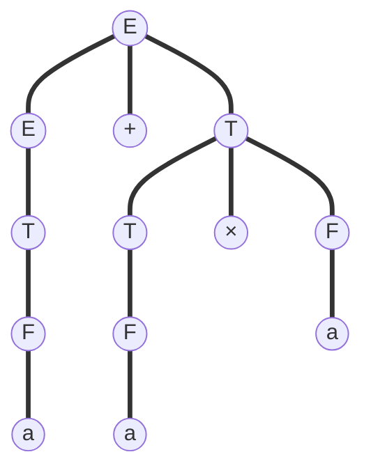

# Lecture 4

## Context-Free Grammar and Context-Free Language

!!! definition

    A **context-free grammar (CFG)** $G = (V, \Sigma, S, R)$, where

    - $V$ is a **finite** set of symbols.
    - $\Sigma \subseteq V$ is the set of **terminals**.
        - $V - \Sigma$ is the set of **non-terminals**.
    - $S \in V - \Sigma$ is the **start symbol**.
    - $R \subseteq (V - \Sigma) \times V^*$ is a **finite** set of rules.
        - $(A, w)$ means $A \rightarrow w$.

!!! definition

    - $\forall x, y, u \in U^*, A \in U - \Sigma$, if $(A, u) \in R$, then we have $xAy \Rightarrow_G xuy$ and we say it **derive in one step**.

    - $\forall w, y, u \in U^*, A \in U - \Sigma$, if $w = u$ or $w \Rightarrow_G \cdots \Rightarrow_G u$, then we have $w \Rightarrow^*_G u$ and we say it **a derivation from $w$ to $u$ of length $n$**.

!!! definition

    $G$ generates $w \in \Sigma^*$ if $S \Rightarrow^*_G w$.

    For $L(G) = \{w \in \Sigma^* | G \text{ generates } w\}$., we say $G$ **generates** $L(G)$.

!!! definition

    We do a **leftmost derivation** of a string from a grammar by

    1. Begin with a string consisting only of the start symbol.
    2. Pick the **leftmost** variable occurrence in the current string.
    3. Pick any production that has that variable on the left of the $\rightarrow$.
    .
    4. Replace the chosen occurrence of that variable by the right-hand side of the chosen production.
    5. Repeat steps 2-4 until the string contains only terminals.

    Similarly, we have **rightmost derivation**.


Sometimes, leftmost derivation is the same as rightmost derivation.

!!! example

    For grammar $S \rightarrow SS$, $S \rightarrow (S)$, $S \rightarrow e$, to get $()()$ from $S$,

    - (leftmost) $S \rightarrow SS \rightarrow (S)S \rightarrow ()S \rightarrow ()(S) \rightarrow ()()$
    - (rightmost) $S \rightarrow SS \rightarrow S(S) \rightarrow S() \rightarrow (S)() \rightarrow ()()$

But sometimes not.

!!! example

    For grammar $E \rightarrow E + E$, $E \rightarrow E \times E$, $E \rightarrow (E)$, $E \rightarrow a$ to get $a + a \times a$ from $S$,

We call it an **ambiguous** expression. To find out the difference, we first introduce parse tree.


## Parse Tree

!!! definition

    Parse trees are a way of recording derivations that focus less upon the order in which derivation steps were applied and more on which productions were employed.

    A parse tree for a string $s$ in a languages described by a CFG is a tree in which

    1. The root of the tree is labeled with $S$.
    2. Each internal node is labeled with a variable.
    3. Each leaf node is labeled with a **terminal**.
    4. The leaf nodes, read from left to right, provide the string $s$.
    5. Each internal node labeled with a variable $A$ has children labeled with the symbols of $\alpha$ (reading left to right through the children) only if $A \rightarrow \alpha$ is a production in the grammar.

!!! example

    For the two cases above, their corresponding parse trees are

    ```mermaid
    graph TD;
        N1(("S"))
        N2(("S"))
        N3(("S"))
        N4(("("))
        N5(("S"))
        N6((")"))
        N7(("("))
        N8(("S"))
        N9((")"))
        N10(("e"))
        N11(("e"))
        N1 === N2
        N1 === N3
        N2 === N4
        N2 === N5
        N2 === N6
        N3 === N7
        N3 === N8
        N3 === N9
        N5 === N10
        N8 === N11
    ```

    === "First Probability (multiply then add)"

        ```mermaid
        graph TD;
            N1(("E"))
            N2(("E"))
            N3(("+"))
            N4(("E"))
            N5(("a"))
            N6(("E"))
            N7(("×"))
            N8(("E"))
            N9(("a"))
            N10(("a"))
            N1 === N2
            N1 === N3
            N1 === N4
            N2 === N5
            N4 === N6
            N4 === N7
            N4 === N8
            N6 === N9
            N8 === N10
        ```
    
    === "Second Probability (add then muliply)"

        ```mermaid
        graph TD;
            N1(("E"))
            N2(("E"))
            N3(("×"))
            N4(("E"))
            N5(("E"))
            N6(("+"))
            N7(("E"))
            N8(("a"))
            N9(("a"))
            N10(("a"))
            N1 === N2
            N1 === N3
            N1 === N4
            N2 === N5
            N2 === N6
            N2 === N7
            N4 === N8
            N5 === N9
            N7 === N10
        ```

For the latter case, to eliminate ambiguity, we can define another grammar,

$$
\begin{aligned}
E &\rightarrow E + T \\
E &\rightarrow T \\
T &\rightarrow T \times F \\
T &\rightarrow F \\
F &\rightarrow (E) \\
F &\rightarrow a \\
\end{aligned}
$$

Then we can build the unique parse tree of $a + a \times a$.



!!! definition

    A CFG is in **Chomsky normal form (CNF)** if every rule of it is of one of the following forms.

    - $S \rightarrow e$.
    - $A \rightarrow BC$, where $B, C \in V - \Sigma - \{S\}$.
    - $A \rightarrow a$, where $a \in \Sigma$.

!!! theorem "Property"

    Suppose $G$ is a CFG in CNF, if $G$ generates a string of length $n \ge 1$, then the length of derivation is exactly $2n-1$.

!!! theorem
    Every CFG has an equivalent CFG in CNF.

## Pushdown Automata (PDA)

!!! definition

    > PDA = NFA + stack

    A PDA is a 6-tuple $P = (K, \Gamma, \Sigma, \Delta, S, F)$,

    - $K$ is a finite set of states.
    - $\Gamma$ is the stack alphabet.
    - $\Sigma$ is the input alphabet.
    - $S \in k$ is initial state.
    - $F \subseteq k$ is the set of final states.
    - $\Delta$ is a transition **relation**. It describes in the current state and a string at the top of the stack, when read a symbol, what will the next state be, and then pop the top string, push another string onto the stack.

        $$
            \Delta \subseteq (K \times (\Sigma \cup \{e\}) \times \Gamma^*) \times (K \times \Gamma^*)
        $$

!!! definition

    - **Yields in one step**

        - $(p, x, \alpha) \vdash_P (q, y, \beta)$ if $\exists ((p, a, \gamma), (q, \eta))$, such that $x = ay$, $\alpha = \gamma\tau$ and $\beta = \gamma\tau$ for some $\tau \in \Gamma^*$.
    
    - **Yields**

         - $(p, x, \alpha) \vdash_P^* (q, y, \beta)$ if $(p, x, \alpha) = (q, y, \beta)$ or $(p, x, a) \vdash_P \cdots \vdash_P (q, y, \beta)$.

!!! definition

    $P$ accepts $w \in \Sigma$ if $(s, w, e) \vdash_P^* (q, e, e)$ for some $q \in F$.

    For $L(P) = \{ w \in \Sigma^*: P \text{ accepts } w \}$, we say $P$ **accepts** $L(P)$.

!!! example

    Show that $\{w \in \{0, 1\}^* | \text{ the number of 0 equals the number of 1}\}$ can be accepted by a PDA.

    **Proof**

    Construct a PDA $P = (K, \Gamma, \Sigma, \Delta, S, F)$, where

    - $K = \{s, q, f\}$.
    - $\Gamma = \{0, 1, \$\}$, where $\$$ means the bottom of the stack.
    - $\Sigma = \{0, 1\}$.
    - $S = s$.
    - $F = \{f\}$.
    - transition relation

        $$
        \begin{aligned}
            \Delta = \{ & ((s, e, e), (q, \$)), \\
                        & ((q, 0, 0), (q, 00)), \\
                        & ((q, 0, \$), (q, 0\$)),  \\
                        & ((q, 0, 1), (q, e)),  \\
                        & ((q, 1, 1), (q, 11)), \\
                        & ((q, 1, \$), (q, 1\$)),  \\
                        & ((q, 1, 0), (q, e)),  \\
                        & ((q, e, \$), (f, e))
                     \}
        \end{aligned}
        $$

    > I think $\$ \in \Gamma$ here is to make $q$ not the final state.

    Considering that PDA is NFA, we can construct a better PDA, with

    - $K = \{s\}$.
    - $\Gamma = \{0, 1\}$.
    - $\Sigma = \{0, 1\}$.
    - $S = s$.
    - $F = \{s\}$.
    - transition relation

        $$
        \begin{aligned}
            \Delta = \{ & ((s, 0, 1), (s, e)), \\
                        & ((s, 0, e), (s, 0)), \\
                        & ((s, 1, 0), (s, e)),  \\
                        & ((s, 1, e), (s, 1))
                     \}
        \end{aligned}
        $$